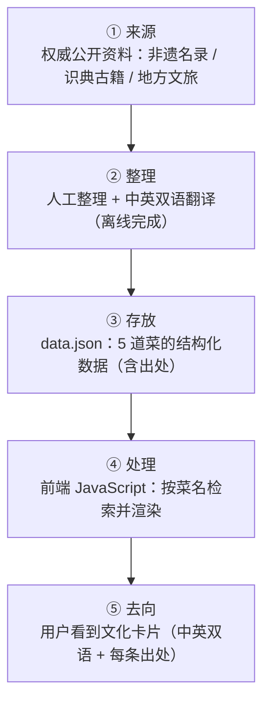

# TECH_DESIGN：寻味 / Xunwei —— 中华美食文化检索

| 项 | 内容 |
|---|---|
| 产品名 | 寻味 / Xunwei |
| 版本 | **MVP v0.1 技术设计** |
| 目标用户 | 在华外国人 |
| 作者 | Amity |
| 日期 | 2026-09-20（Day 5） |
| 上游依据 | `PRD.md`（产品需求）／`research-文化检索.md`（研究结论） |
| 本文件定位 | 五步工作流**第 3 步**产出（设计系统），供第 4 步（AI 配置）与第 5 步（构建）使用 |

---

## 1. 项目背景（一句话）

把已有的权威中国饮食文化资料，**翻译成在华外国人看得懂的中英双语文化卡片**，并且每一条都标得清出处。

**技术上要满足的需求只有一件事**：用户搜一个菜名，把对应的内容**取出来显示**。
—— 没有登录、没有发帖、没有下单、没有任何"要写回去"的动作。

---

## 2. 技术路线

> ⭐ **技术路线（Technology Stack）**：
> **原生 HTML + CSS + JavaScript ＋ 单个 JSON 数据文件 ＋ GitHub Pages 静态托管**
> （**不使用框架、不使用后端、不使用数据库**）

### 2.1 为什么选它（三条理由）

| # | 理由 | 依据 |
|---|---|---|
| 1 | **PRD 明确没有写入功能** —— 没有任何东西需要"存下来"和"改" | `PRD.md` §9 非目标第 3、4 条 |
| 2 | **内容只有 5 道菜** —— 数据小到可以直接放在一个文件里，这个文件本身就是最合适的"仓库" | `PRD.md` §4 本期范围 |
| 3 | **要在 Day 7 前做出 MVP** —— 部件越少，按时做出来的概率越高 | 课程节奏（Day 7 为 MVP） |

### 2.2 为什么"不用后端、不用数据库"（逐条对照）

| 部件 | 什么情况下才需要 | 我们的情况 | 结论 |
|---|---|---|---|
| 后端 | 需要**根据请求去查 / 去算 / 去改** | 只是"取出对应内容显示"，不需要算、不需要改 | ❌ 不需要 |
| 数据库 | 数据**被频繁改动**，或**多到不适合放在文件里** | 5 道菜、只有我们自己改、改完重新发布即可 | ❌ 不需要 |

### 2.3 为什么"不用框架"

框架（React / Vue 这类）是别人写好的、帮你组织代码的工具。本版不用，理由三条：

1. 5 道菜的数据量，**用不上**框架带来的好处
2. **少一层工具，就少一类报错** —— 对第一次做产品的人是实实在在的省事
3. Day 7 出 MVP 的概率更高

> 这不是"以后不能反悔"：将来功能变多再引入框架，**数据结构和文档一样能用**。

### 2.4 考虑过但没选的路线

| 路线 | 为什么没选 |
|---|---|
| 前端 + 后端 + 数据库 | 本期无写入，属于**过度设计**；引入服务器、运维与成本 |
| 前端 + 无服务器函数 | 本期没有需要"动态计算"的场景，引入额外服务不划算 |
| 使用前端框架 | 见 2.3 |

---

## 3. 各部分分工

| 部件 | 具体用什么 | 负责什么 |
|---|---|---|
| **前端** | `index.html` + `css/style.css` + `js/app.js` | 页面结构、样式、检索与渲染 |
| **数据** | `data/dishes.json` | 存放 5 道菜的结构化内容（含出处） |
| **托管** | GitHub Pages | 把仓库里的静态文件发布成可访问的网站，免费 |

> 说明：本版**没有后端、没有数据库**。所谓"数据仓库"，就是仓库里的一个 `dishes.json` 文件。

---

## 4. 数据流图



> ⚠️ 请注意：整条链是**单向**的。
> **用户端不产生任何数据回流** —— 没有登录、没有评论、没有投稿。
> **这就是我们不需要后端和数据库的直接原因。**

---

## 5. 一句话说清：数据从哪来、到哪去

> **数据从「公开权威资料」来**（非遗名录 / 识典古籍 / 地方文旅官方发布），
> 由我们**人工整理并翻译**，写进一个 `data.json` 文件，随网站一起发布；
> 用户搜索时，由**前端读取并渲染成文化卡片**给他看。
> **→ 全程单向：从资料来，到用户眼里去，用户不产生任何数据。**

---

## 6. 数据结构（`data/dishes.json` 字段草案）

| 字段 | 说明 |
|---|---|
| `id` | 唯一标识（英文，如 `luosifen`） |
| `name.zh` / `name.en` | 中文名 / 英文名 |
| `aliases` | 别名 + 常见错别字（用于搜索容错，如"螺狮粉"） |
| `origin` / `story` / `technique` | 三个板块：**渊源 / 文化典故 / 做法特点**，每块都含 `zh` 与 `en` 两段文本 |
| `facts` | 事实性陈述列表（每条对应 PRD 的"必须标出处"要求） |
| `sources` | 出处数组：`title`（来源名称）+ `url` + `accessed`（访问日期） |

> 说明：每一条 `facts` 都要能指向 `sources` 里的具体一项 —— 这是 PRD 验收标准第 7、8 条的落地方式。

---

## 7. 目录结构（草案）

```
vibe coding实战/
├── index.html          # 单页：搜索框 + 卡片区（用 JS 切换视图）
├── css/style.css       # 样式
├── js/app.js           # 检索与渲染逻辑
├── data/dishes.json    # 5 道菜的结构化数据（含出处）
├── PRD.md / TECH_DESIGN.md / research*.md / AGENTS.md
└── .gitignore
```

**为什么做单页**：只有 5 道菜，不需要页面路由；少一个页面就少一次跳转处理。若 Day 7 发现拆成两页更简单，可再改。

---

## 8. 本期不引入什么

| 不引入 | 为什么 |
|---|---|
| 后端服务 | 无写入需求 |
| 数据库 | 数据量小且只有我们自己改 |
| 前端框架（React / Vue） | 用不上，且多一层出错机会 |
| 构建 / 打包工具（npm 依赖） | 没有需要打包的东西 |
| 用户系统 / UGC | `PRD.md` §9 非目标第 3、4 条 |
| 第三方 API | 内容来自人工整理的公开资料，不需要实时调用 |

> 备注：Day 1 装的 Node.js 第一版**可能用不到**，但它在本地预览服务器等场景仍有用处（见第 10 节第 1 条）。

---

## 9. 未来若要加入「用户发帖（UGC）」，需要补什么

> 本节记录一个 **2026-09-20 提出的产品想法**（用户可注册、像发帖一样保存自己记忆中的美食）。
> **本期明确不做**；此处只把"要补什么"记下来，避免想法丢失。
> 对应 `PRD.md` §10 待定第 5 条。

除了后端和数据库，还要补：

| 需要补的 | 为什么 |
|---|---|
| 用户认证 | 得知道"是谁发的"、"谁能改、谁能删" |
| 内容审核 | 否则会被灌垃圾与违规内容，这是平台责任 |
| 图片 / 文件存储 | 用户一定会传照片 |
| 隐私与合规 | 收集用户信息涉及个人信息保护，还要有用户协议 + 隐私政策 |
| 冷启动方案 | 没内容 → 没人来 → 更没内容 |
| 成本与运维 | 服务器与数据库要花钱，还要盯着别挂 |

**一句话**：这是**另一个量级的产品**，不是"顺手加个小功能"。它更适合作为**第二版方向**。

---

## 10. 待定与风险

| # | 待定 / 风险 | 说明与处理 |
|---|---|---|
| 1 | **本地预览方式** | 直接双击 `index.html` 时，浏览器可能不允许 JS 读取本地 `.json` 文件（同源限制）。两个解法：① 把数据写进 `.js` 文件；② 本地起一个预览服务器（正好用上 Node.js）。**Day 7 构建时定** |
| 2 | **英文内容怎么产出** | 人工翻译 vs 机翻 + 人工校对 —— `PRD.md` §10 第 3 条未决；底线是英文内容也必须可溯源 |
| 3 | **5 道菜的具体名单** | 选择标准已在 `PRD.md` §4.1 定下，名单在构建前定稿 |
| 4 | **部署方式细节** | GitHub Pages 的具体配置（分支、目录）留到 Day 7 操作时定 |
| 5 | **需求真实性未验证** | 目标用户画像仍是【推测】，建议尽快做 3–5 人小访谈（对应 `PRD.md` §8 成功指标） |
