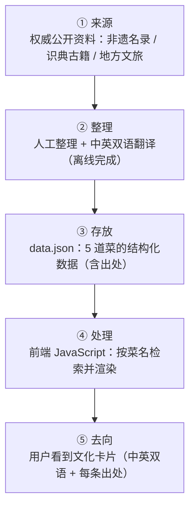

# TECH_DESIGN：寻味 / Xunwei —— 中华美食文化检索

| 项 | 内容 |
|---|---|
| 产品名 | 寻味 / Xunwei |
| 版本 | **MVP v0.1 技术设计** |
| 目标用户 | 在华外国人 |
| 作者 | Amity |
| 日期 | 2026-09-20（Day 5） |
| 上游依据 | `PRD.md`（产品需求）／`research-文化检索.md`（研究结论） |
| 本文件定位 | 五步工作流**第 3 步**产出（设计系统），供第 4 步（AI 配置）与第 5 步（构建）使用 |

---

## 1. 项目背景（一句话）

把已有的权威中国饮食文化资料，**翻译成在华外国人看得懂的中英双语文化卡片**，并且每一条都标得清出处。

**技术上要满足的需求只有一件事**：用户搜一个菜名，把对应的内容**取出来显示**。
—— 没有登录、没有发帖、没有下单、没有任何"要写回去"的动作。

---

## 2. 技术路线

> ⭐ **技术路线（Technology Stack）**：
> **原生 HTML + CSS + JavaScript ＋ 单个 JSON 数据文件 ＋ GitHub Pages 静态托管**
> （**不使用框架、不使用后端、不使用数据库**）

### 2.1 为什么选它（三条理由）

| # | 理由 | 依据 |
|---|---|---|
| 1 | **PRD 明确没有写入功能** —— 没有任何东西需要"存下来"和"改" | `PRD.md` §9 非目标第 3、4 条 |
| 2 | **内容只有 5 道菜** —— 数据小到可以直接放在一个文件里，这个文件本身就是最合适的"仓库" | `PRD.md` §4 本期范围 |
| 3 | **要在 Day 7 前做出 MVP** —— 部件越少，按时做出来的概率越高 | 课程节奏（Day 7 为 MVP） |

### 2.2 为什么"不用后端、不用数据库"（逐条对照）

| 部件 | 什么情况下才需要 | 我们的情况 | 结论 |
|---|---|---|---|
| 后端 | 需要**根据请求去查 / 去算 / 去改** | 只是"取出对应内容显示"，不需要算、不需要改 | ❌ 不需要 |
| 数据库 | 数据**被频繁改动**，或**多到不适合放在文件里** | 5 道菜、只有我们自己改、改完重新发布即可 | ❌ 不需要 |

### 2.3 为什么"不用框架"

框架（React / Vue 这类）是别人写好的、帮你组织代码的工具。本版不用，理由三条：

1. 5 道菜的数据量，**用不上**框架带来的好处
2. **少一层工具，就少一类报错** —— 对第一次做产品的人是实实在在的省事
3. Day 7 出 MVP 的概率更高

> 这不是"以后不能反悔"：将来功能变多再引入框架，**数据结构和文档一样能用**。

### 2.4 考虑过但没选的路线

| 路线 | 为什么没选 |
|---|---|
| 前端 + 后端 + 数据库 | 本期无写入，属于**过度设计**；引入服务器、运维与成本 |
| 前端 + 无服务器函数 | 本期没有需要"动态计算"的场景，引入额外服务不划算 |
| 使用前端框架 | 见 2.3 |

---

## 3. 各部分分工

| 部件 | 具体用什么 | 负责什么 |
|---|---|---|
| **前端** | `index.html` + `css/style.css` + `js/app.js` | 页面结构、样式、检索与渲染 |
| **数据** | `data/dishes.json` | 存放 5 道菜的结构化内容（含出处） |
| **托管** | GitHub Pages | 把仓库里的静态文件发布成可访问的网站，免费 |

> 说明：本版**没有后端、没有数据库**。所谓"数据仓库"，就是仓库里的一个 `dishes.json` 文件。

---

## 4. 数据流图


```mermaid
flowchart TD
    A["① 来源<br/>权威公开资料：非遗名录 / 识典古籍 / 地方文旅"] --> B["② 整理<br/>人工整理 + 中英双语翻译（离线完成）"]
    B --> C["③ 存放<br/>data.json：5 道菜的结构化数据（含出处）"]
    C --> D["④ 处理<br/>前端 JavaScript：按菜名检索并渲染"]
    D --> E["⑤ 去向<br/>用户看到文化卡片（中英双语 + 每条出处）"]
```

> ⚠️ 请注意：整条链是**单向**的。
> **用户端不产生任何数据回流** —— 没有登录、没有评论、没有投稿。
> **这就是我们不需要后端和数据库的直接原因。**

---

## 5. 一句话说清：数据从哪来、到哪去

> **数据从「公开权威资料」来**（非遗名录 / 识典古籍 / 地方文旅官方发布），
> 由我们**人工整理并翻译**，写进一个 `data.json` 文件，随网站一起发布；
> 用户搜索时，由**前端读取并渲染成文化卡片**给他看。
> **→ 全程单向：从资料来，到用户眼里去，用户不产生任何数据。**

---

## 6. 数据结构（`data/dishes.json` 字段草案）

| 字段 | 说明 |
|---|---|
| `id` | 唯一标识（英文，如 `luosifen`） |
| `name.zh` / `name.en` | 中文名 / 英文名 |
| `aliases` | 别名 + 常见错别字（用于搜索容错，如"螺狮粉"） |
| `origin` / `story` / `technique` | 三个板块：**渊源 / 文化典故 / 做法特点**，每块都含 `zh` 与 `en` 两段文本 |
| `facts` | 事实性陈述列表（每条对应 PRD 的"必须标出处"要求） |
| `sources` | 出处数组：`title`（来源名称）+ `url` + `accessed`（访问日期） |

> 说明：每一条 `facts` 都要能指向 `sources` 里的具体一项 —— 这是 PRD 验收标准第 7、8 条的落地方式。

---

## 7. 目录结构（草案）

```
vibe coding实战/
├── index.html          # 单页：搜索框 + 卡片区（用 JS 切换视图）
├── css/style.css       # 样式
├── js/app.js           # 检索与渲染逻辑
├── data/dishes.json    # 5 道菜的结构化数据（含出处）
├── PRD.md / TECH_DESIGN.md / research*.md / AGENTS.md
└── .gitignore
```

**为什么做单页**：只有 5 道菜，不需要页面路由；少一个页面就少一次跳转处理。若 Day 7 发现拆成两页更简单，可再改。

> **Day 13 备注**：这里的判断仍然成立（站点保持单页），但「不需要路由」这一句已随视图数量增加而更新 —— 见第 11 节。简言之：**还是单页，只是页内视图要「可寻址」**。

---

## 8. 本期不引入什么

| 不引入 | 为什么 |
|---|---|
| 后端服务 | 无写入需求 |
| 数据库 | 数据量小且只有我们自己改 |
| 前端框架（React / Vue） | 用不上，且多一层出错机会 |
| 构建 / 打包工具（npm 依赖） | 没有需要打包的东西 |
| 用户系统 / UGC | `PRD.md` §9 非目标第 3、4 条 |
| 第三方 API | 内容来自人工整理的公开资料，不需要实时调用 |

> 备注：Day 1 装的 Node.js 第一版**可能用不到**，但它在本地预览服务器等场景仍有用处（见第 10 节第 1 条）。

---

## 9. 未来若要加入「用户发帖（UGC）」，需要补什么

> 本节记录一个 **2026-09-20 提出的产品想法**（用户可注册、像发帖一样保存自己记忆中的美食）。
> **本期明确不做**；此处只把"要补什么"记下来，避免想法丢失。
> 对应 `PRD.md` §10 待定第 5 条。

除了后端和数据库，还要补：

| 需要补的 | 为什么 |
|---|---|
| 用户认证 | 得知道"是谁发的"、"谁能改、谁能删" |
| 内容审核 | 否则会被灌垃圾与违规内容，这是平台责任 |
| 图片 / 文件存储 | 用户一定会传照片 |
| 隐私与合规 | 收集用户信息涉及个人信息保护，还要有用户协议 + 隐私政策 |
| 冷启动方案 | 没内容 → 没人来 → 更没内容 |
| 成本与运维 | 服务器与数据库要花钱，还要盯着别挂 |

**一句话**：这是**另一个量级的产品**，不是"顺手加个小功能"。它更适合作为**第二版方向**。

---

## 10. 待定与风险

| # | 待定 / 风险 | 说明与处理 |
|---|---|---|
| 1 | **本地预览方式** | 直接双击 `index.html` 时，浏览器可能不允许 JS 读取本地 `.json` 文件（同源限制）。两个解法：① 把数据写进 `.js` 文件；② 本地起一个预览服务器（正好用上 Node.js）。**Day 7 构建时定** |
| 2 | **英文内容怎么产出** | 人工翻译 vs 机翻 + 人工校对 —— `PRD.md` §10 第 3 条未决；底线是英文内容也必须可溯源 |
| 3 | **5 道菜的具体名单** | 选择标准已在 `PRD.md` §4.1 定下，名单在构建前定稿 |
| 4 | **部署方式细节** | GitHub Pages 的具体配置（分支、目录）留到 Day 7 操作时定 |
| 5 | **需求真实性未验证** | 目标用户画像仍是【推测】，建议尽快做 3–5 人小访谈（对应 `PRD.md` §8 成功指标） |

---

## 11. 视图结构与路由设计（Day 13 追加）

### 11.1 背景：从「2 个视图」到「3 个视图」

Day 8 到 Day 12，站点一直只有 **2 个视图**：检索列表、文化卡片。两者靠 DOM 的 `hidden` 开关来回切，**地址栏全程不变化**。

第 7 节当初写着「只有 5 道菜，不需要页面路由」——那时成立，因为只有一个入口（搜索框）。现在内容要扩到 34 个省级行政区，用户会先问「你们都收录了哪些地方」，**需要一个「目录页」**；三个视图来回切换之后，「我现在在哪一屏」就必须说得清。

**结论：仍然保持单页**（不拆成多个 `.html`），但引入 **hash 路由**，让单页内部的视图变成「可寻址」的。第 7 节的判断没有被推翻，只是前提变了：视图从一个变成三个。

### 11.2 三个视图与 URL 对应表

| 视图 | URL | 说明 | 层级 |
|---|---|---|---|
| **A 检索列表** | `#/` | 搜索框 + 筛选条 + 结果列表（默认入口） | 二级 |
| **A′ 带地区条件的列表** | `#/region/guangxi` | 与 A 同一个视图，只是带上了地区条件 | 二级 |
| **B 地区索引** | `#/regions` | 按七大地理分区列出 34 个省级行政区，并显示各地已收录几道 | 一级（目录） |
| **C 文化卡片** | `#/dish/luosifen` | 单道菜的中英双语文化卡片 | 三级 |

```
  #/regions ──点某地区──▶ #/region/guangxi ──点某道菜──▶ #/dish/luosifen
   （目录）                 （该地区列表）              （文化卡片）
      ▲                         │                          │
      └────── 返回 ─────────────┴───────── 返回 ────────────┘

  #/  ← 默认入口（不筛地区的检索列表）
```

### 11.3 为什么选 Hash 路由（Day 13 的必答问题）

| 方案 | 地址栏 | 刷新 / 直接打开链接 | 前进后退 | 代价 |
|---|---|---|---|---|
| **甲 · Hash 路由** ✅ | 跟着变，可分享 | 正常 | 天然可用 | URL 里多一个 `#` |
| 乙 · History API | 跟着变，更干净 | **静态托管下 404** | 可用 | 要给 GitHub Pages 与本地预览都做 404 兜底 |
| 丙 · 纯 DOM 切换（原状） | **不变** | 正常 | **无效** | 链接不可分享；无法证明「此刻在哪一屏」 |

**选甲，三条理由：**

1. **静态托管零配置** —— GitHub Pages 与本地 `python -m http.server` 都不需要任何服务端规则；选乙就必须额外做 404 回退，多一层与产品无关的复杂度。
2. **地址栏本身就是证据** —— `#/dish/luosifen` 一眼看出在看哪道菜，复制给别人能直接打开。
3. **前进 / 后退 / 刷新天然正确** —— 浏览器自己处理，我们只需要监听 `hashchange`。

**如实记录代价**：URL 里多一个 `#`，不够美观；对搜索引擎不友好。但本产品是一个内容检索小站，不依赖自然搜索流量，这两点不构成实际损失。

### 11.4 路由表（代码要实现的契约）

| hash 模式 | 派发到 | 无效时怎么办 |
|---|---|---|
| 空 或 `#/` | 列表视图（全部） | — |
| `#/region/:slug` | 列表视图 + 设置筛选 | 未知 slug → 退回 `#/` 并提示 |
| `#/regions` | 地区索引视图 | — |
| `#/dish/:id` | 文化卡片视图 | 未知 id → 退回 `#/` 并提示"没找到这道菜" |
| 其它任意字符串 | 退回 `#/` | **三级兜底**：任何看不懂的 hash 都落到列表，绝不白屏 |

> 「任何 hash 都有去处」是这张表的核心：用户手改地址栏、旧链接失效，都不该看到空白页。

### 11.5 地区索引视图的数据从哪来（**不新增任何数据**）

- **静态清单**：34 个省级行政区及其所属七大地理分区，写成 JS 里的一张表（属于「界面结构」，不是"内容数据"，所以不进 `dishes.json`）。
- **匹配规则**：沿用现有 `regionMatches()` 的 `dish.region.zh.indexOf(省名) === 0`，例如 `"浙江丽水缙云".indexOf("浙江") === 0` 命中浙江。
- **每个地区"已收录几道"是算出来的**，不是另存一份 → 全站数据仍然只有 `dishes.json` 这一个来源（呼应第 3 节）。
- 尚未收录的地区显示为灰色占位，点击提示"暂未收录"，同时为后续补齐 34 省预留入口。

### 11.6 与既有代码的衔接（要动三处）

| # | 位置 | 改动 |
|---|---|---|
| 1 | `openDish(id)` / `showSearchView()` | 不再自己开关 `hidden`，改为「改 hash」，由 router 统一渲染（否则两处抢着改 DOM，必出不一致） |
| 2 | 新增 `js/router.js` | 解析 hash → 派发到渲染函数；监听 `hashchange`；首次进入按 hash 决定初始视图 |
| 3 | `applyState()` | 从「列表视图专用」提升为通用机制，让索引视图也能显示 加载 / 空 / 失败 |

### 11.7 本次明确不做

- **不动 GitHub Pages 配置** —— Hash 方案不需要任何服务端配合。
- **不引入路由库** —— 三条路由用原生二三十行就够，加了库反而看不懂。
- **不新增菜品数据** —— 索引视图只用现有 `dishes.json` 现算（新增数据是另一条任务线）。
- **不改筛选条** —— 顶部那 6 个地区按钮维持原样，全量浏览交给索引视图负责。

### 11.8 实现记录（Day 13 板块②，2026-09-29）

**落地清单**

| 文件 | 状态 | 内容 |
|---|---|---|
| `js/router.js` | 新增（约 120 行） | `parse()` / `go()` / `replace()` / `start()`。不认识 DOM，不碰任何视图 |
| `js/app.js` | 改 | 新增「0. 路由」小节（`onRoute` / `renderRoute` / `setViewVisibility` / `renderBreadcrumb` / `updateTitle`）、REGIONS 静态表、第 8 节地区索引渲染；`openDish` 与 `showSearchView` 里的视图开关全部撤掉 |
| `index.html` | 改 | 新增 `#region-view`、面包屑 `<nav>`、搜索框下方的目录页入口；挂上 `router.js` |
| `css/style.css` | 改 | 面包屑、目录页入口、地区分组与地区卡片（含"未收录"虚线态） |

**修正 §11.2**：地区参数改用**拼音 slug**（`#/region/guangxi`）而不是中文。
原因是实测发现浏览器地址栏会把中文 hash 显示成 `%E5%B9%BF%E8%A5%BF` 那种编码，
"一眼看出在看哪个地区"这条好处就没了，截图和分享也读不懂。
slug 还与菜品 id（`#/dish/luosifen`）风格统一。陕西的 slug 只能用 `shaanxi`，纯拼音会和山西撞车。

**实测踩到的三个坑（都记在这里，别再踩）**

1. **`var` 的赋值不会提前。**
   `preShowRouteView()` 在脚本一执行就要读 `VIEW_OF_ROUTE`，而它当时还写在下面 ——
   `var` 只有声明被提升、赋值没有，于是读到 `undefined`，
   整份 `app.js` 一行没跑就抛错，页面停在 HTML 里的静态兜底上
   （现象很有迷惑性：路由看起来"完全没反应"）。
   修法：把这两个常量挪到 `preShowRouteView()` 之前，并在代码里留了警示注释。

2. **`refreshList()` 的 `loading` 守卫把列表永久锁死在骨架屏。**
   它见到 `listState === 'loading'` 就不动手（本意是"数据没到手别重画"），
   而改造后取数成功时再没人把状态从 `loading` 摘出来。
   修法：取数成功、派发路由之前，先 `state.listState = 'success'`。

3. **`renderRoute()` 抢了 `applyState()` 的活。**
   它在数据没到手时就把 `dishes.length === 0` 当成"一条都没有"，
   于是 `?state=error` 被覆盖成"无结果"。
   修法：列表/地区分支开头加 `if (!state.loaded) { return; }` ——
   **加载中与读取失败该显示什么，归 `loadDishes` 说了算，路由无权覆盖。**

**已知缺口（留给「筛选条改造」那一板）**

顶部筛选条仍是写死的 6 个地区。从目录页进入一个**不在那 6 个里**的地区
（如 `#/region/zhejiang`）时，按钮一个都不亮 —— 此时"当前在哪"由
**面包屑 + 提示条**承担，界面没有说谎，但确实少了一处线索。
这一处等筛选条换成「七大区两级」之后自然消解。

**验收方式**：无头 Edge + CDP 实测 16 个场景（三条路由、三视图显隐、面包屑、
两类兜底、四态、点筛选条、点卡片、浏览器后退、点目录页卡片、面包屑返回），
不是靠肉眼看截图。脚本见工作区 `verify-day13-route.js`（不随项目提交）。

---

## 12. 四种状态的通用化（Day 13 板块③）

### 12.1 问题：四种状态原本是「列表视图的私产」

Day 8 定下四种页面状态（加载中 / 无结果 / 加载失败 / 正常）时，全站只有一屏，
所以 `applyState()` 里写死了那三个状态块的引用（`#state-loading` 等）。
Day 13 加了地区索引与卡片视图之后，这套机制没跟着长：

- 索引视图只能自己临时拼一句话（"正在读取地区资料…"）；
- 卡片视图更糟：数据没到手时它被路由**偷偷换成列表视图**，
  于是**地址栏和面包屑说"你在看卡片"，画面却是列表** —— 三处说法不一致。

### 12.2 做法：状态写在元素的 `data-state` 属性上

认领方式从"代码里的 if"改成"HTML 里的属性"：

| 属性值 | 含义 |
|---|---|
| `data-state="loading"` | 加载中 |
| `data-state="empty"` | 无结果 |
| `data-state="error"` | 加载失败 |
| `data-state="content"` | 正常态才显示的内容（可以有多块） |

`applyViewState(host, name)` 在某一个视图容器内按属性统一开关；
`applyState(name)` 是它的包装 —— 自己判断"现在露在外面的是哪一屏"
（靠 `state.viewName`，**不去问 DOM 谁没 hidden**：状态还没画完时问 DOM，
问出来的是上一轮的答案），把状态画进那一屏。

于是给某个视图加一种新状态，**不用回来改 `app.js`**：在 HTML 里补一块、
写上属性，它就自动纳入了体系。

### 12.3 每个视图各自备一套（共 12 个状态块）

| 视图 | loading | empty | error | content |
|---|---|---|---|---|
| 检索列表 | ✔ 骨架屏 | ✔ 两种文案 | ✔ 带重试 | ✔ 标题 + 列表 |
| 地区索引 | ✔ 骨架屏 | ✔ | ✔ 带重试 | ✔ 分区目录 |
| 文化卡片 | ✔ 卡片骨架 | — | ✔ 带重试 | ✔ 卡片本体 |

卡片视图**没有空态**：一张卡不存在，就是地址里的 id 不对 ——
那种情况由路由统一挡回首页并说明，不放一个空壳卡片在那儿骗人。

### 12.4 三条设计决定

1. **失败态必须给出路。** 索引视图与卡片视图各自带一个「重试」按钮，
   绑的是同一个取数函数。用户在哪里看到失败，就在哪里能重试 ——
   原先那句"请回到首页点重试"是让用户多走一步。
2. **空态分两类，标题也要跟着变。** "没找到这道菜"是"你要找的东西不存在"，
   "还没有收录美食"是整个库都空。两件事共用一句话就是在骗人 ——
   （顺带修掉 Day 8 留下的这处不准确）。
3. **数据全空时，索引视图不铺 34 张「暂未收录」。** 那不是目录，是噪音，
   给正经的空态。

### 12.5 状态与路由的职责边界

- **加载中 / 读取失败显示什么，归取数函数（`loadDishes`）说了算**，
  路由无权覆盖：`renderRoute` 见到 `!state.loaded` 一律调 `applyPendingState()`
  把这件事原样复述，不自作主张（Day 13 板块② 就踩过：`?state=error`
  被路由的空态判定顶掉，看起来像"没搜到"）。
- **失败原因存在 `state.errorMessage` 上**，不停留在"上次画的画面"里。
  否则用户在索引页撞上失败、再走回首页，首页会停在骨架屏一直转。
- **`renderRegionIndex()` 只管成功态怎么画**，不再自己判断数据到没到。

### 12.6 用 URL 复现每一个画面（截图有据可依）

`?state=` 是开发用的调试开关（写在 `js/data-source.js` 里，普通用户看不到），
它只读 `location.search`，所以能和任意 hash 组合：

| 想看的画面 | 地址 |
|---|---|
| 列表 · 加载中 | `?state=loading` |
| 列表 · 无结果 | `?state=empty` |
| 列表 · 失败 | `?state=error` |
| 列表 · 正常 | `/`（不带参数） |
| 索引 · 加载中 | `?state=loading#/regions` |
| 索引 · 无结果 | `?state=empty#/regions` |
| 索引 · 失败 | `?state=error#/regions` |
| 索引 · 正常 | `#/regions` |
| 卡片 · 加载中 | `?state=loading#/dish/luosifen` |
| 卡片 · 失败 | `?state=error#/dish/luosifen` |
| 卡片 · 正常 | `#/dish/luosifen` |

### 12.7 验收

无头 Edge + CDP，脚本 `verify-day13-states.js`，**11 个场景全过、运行期零报错**。
判据是量出来的三件事，不是"看着对"：

1. 同时只有一个视图可见；
2. 该视图内恰好只有一组 `data-state` 可见；
3. **隐藏的视图里一个可见状态都没有** —— 这条专门防"两屏同时亮着"，
   那种毛病肉眼看不出来（元素在隐藏容器里时，探针仍会读到它"没被 hidden"）。

另加 3 项空态标题检查与 16 场景路由回归（`verify-day13-route.js`），同样全过。

### 12.8 已知的小瑕疵（记着，不算错）

卡片视图在**数据还没到手**时，面包屑最后一级显示的是地址里的 id（如 `luosifen`）
而不是中文名 —— 因为此刻还不知道中文名。这是"只显示已知信息、不编造"的选择；
数据一到就会换成正式名称。若以后觉得这一闪不好看，可以在加载态先不显示这一级。

